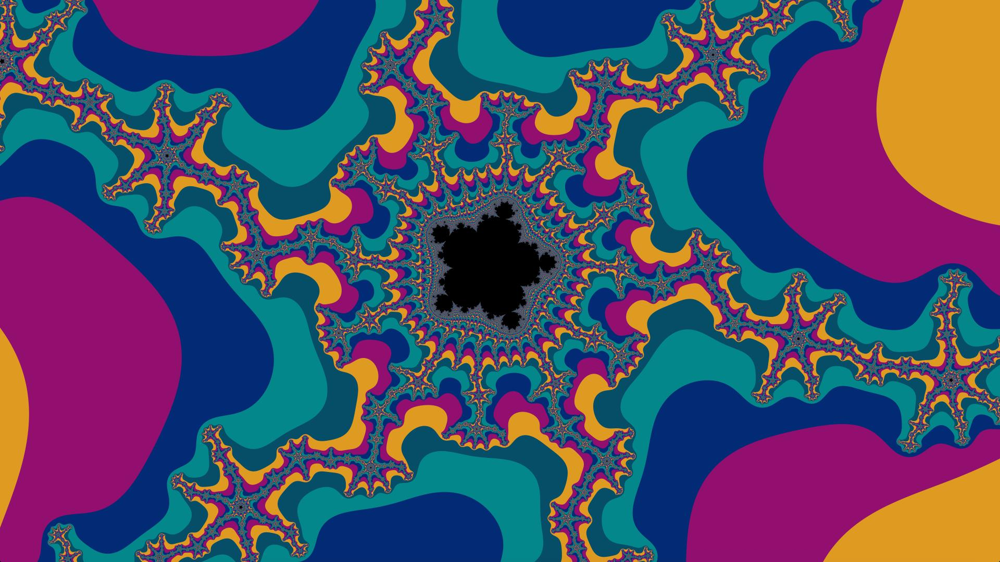
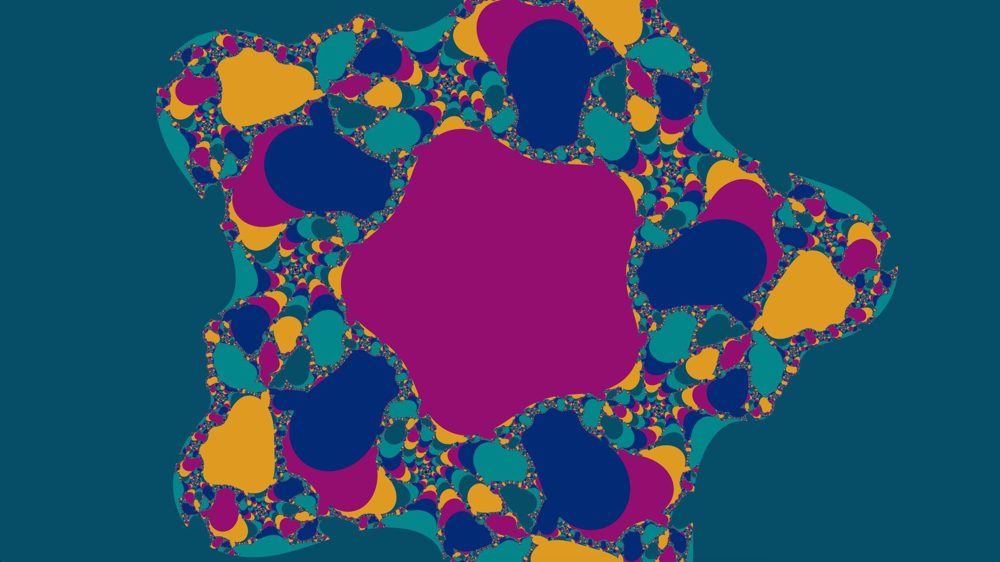
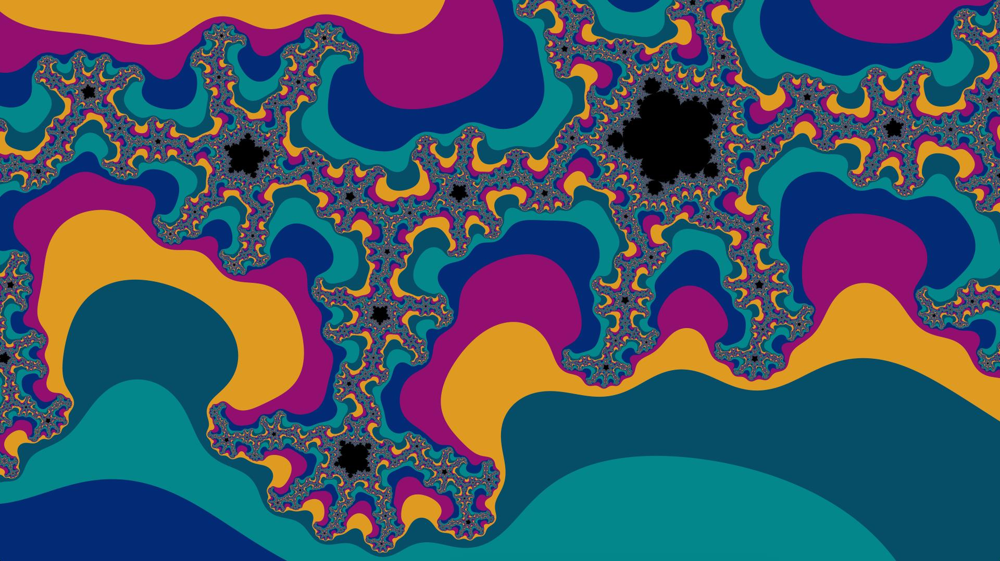
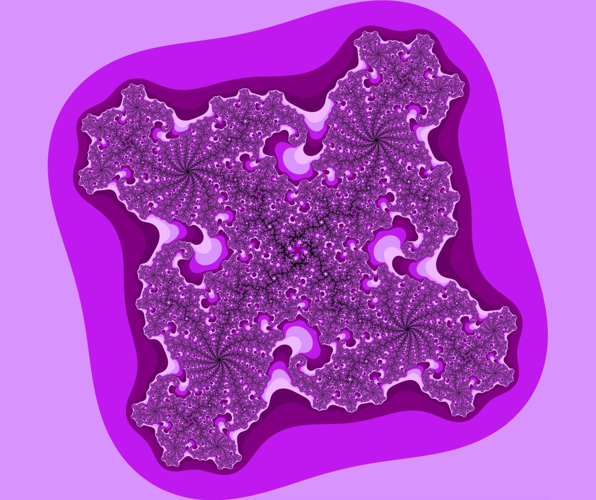
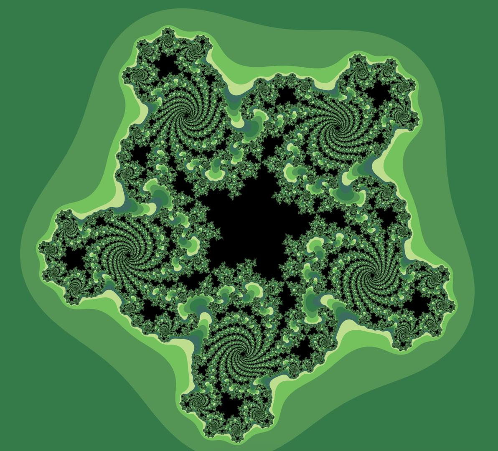
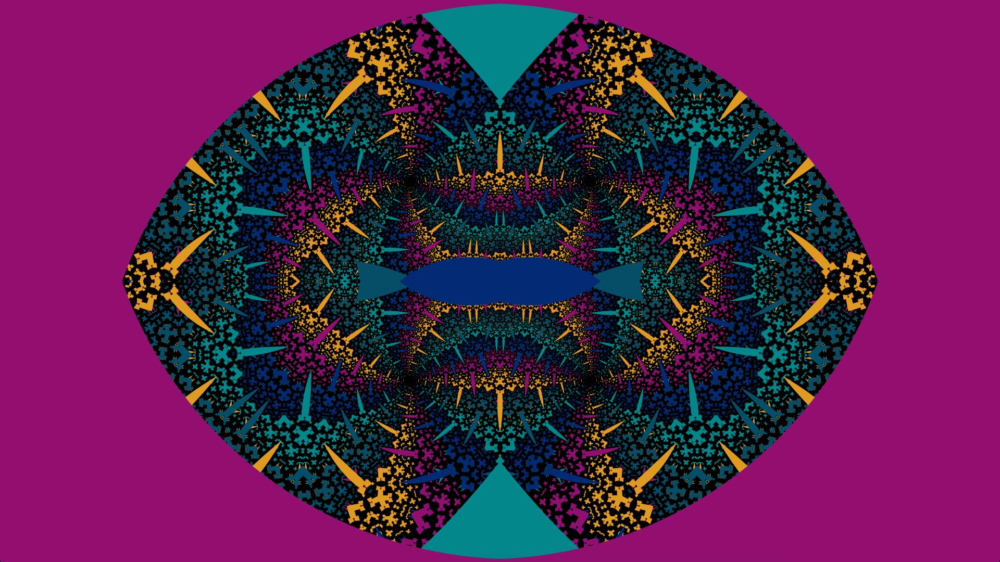
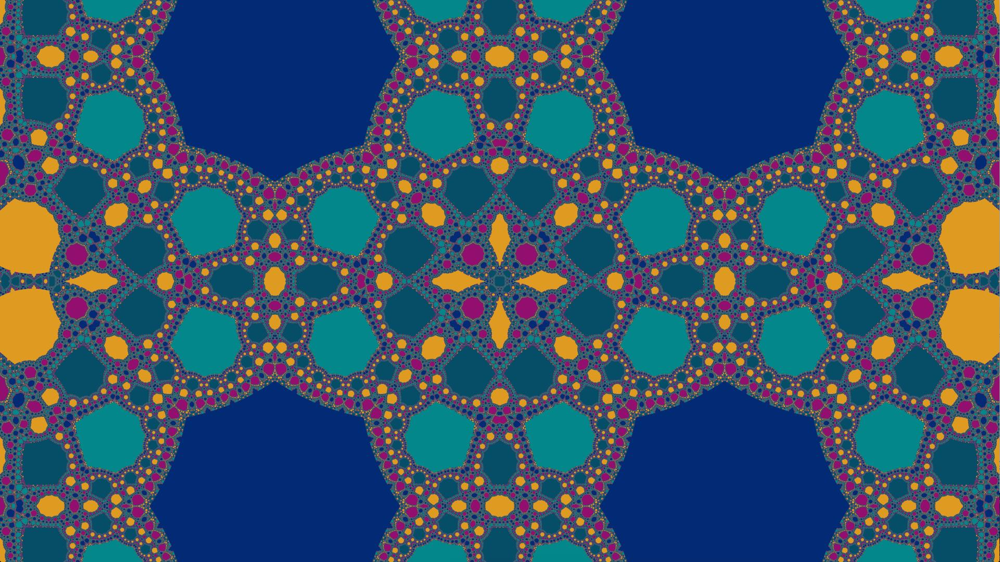
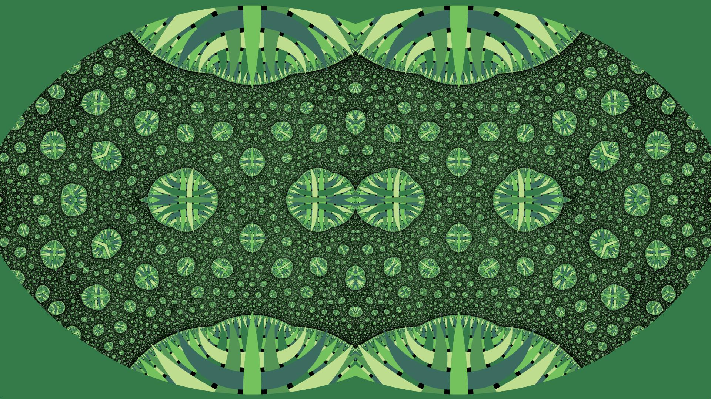
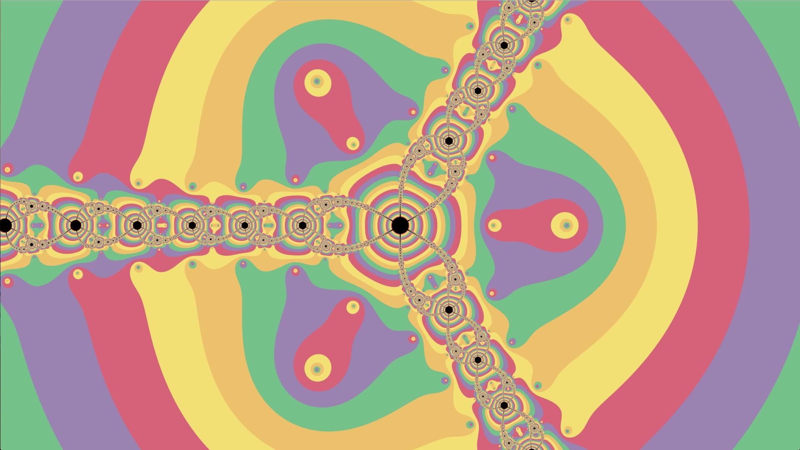

# 
## Fract_ol
Made during **_march 2018_**<br>
The objective of the project was to render different fractals and being able to zoom indefinitely in it. It was an individual school project, made from scratch and entirely in C.

## Installing
#### Mac only portability.<br>
Simply run
```
$ make
```

## Usage
### Running the programm
The programm takes a fractal's name as an argument :
```
$ ./fractol 'Fractal'
```
To show options :
```
$ ./fractol 'options'
```
Fractal list :
- Mandelbrot
- Julia
- Newton
- Mandelneg
- Julneg
- Newtwo
- Mandelbar
- Burning_ship
- Mandisk
- MoZ

### Hotkeys
#### Moving
- **` W A S D `** or ` 🠙 🠘 🠛 🠚 ` to move in the fractal
- **` I J K L `** to move the fractal if it's a Julia type
- **` ~ `** to toggle the cursor variation
#### Zooming
- **` Mouse wheel `** to zoom on the cursor
- **` + `** & **` - `** to zoom in the center of the image
- **` SPACE `** to reset the zoom
#### Colors
- **` 1 2 3 4 5 `** to choose a color
- **` TAB `** to switch to next one
#### Iterations
- **` Z `** to increase iterations
- **` X `** to decrease iterations
- **` C `** to reset iterations
#### Power
- **` R `** to increase power
- **` F `** to decrease power
#### Anti-aliasing (SSAA)
- **` Q `** + **` 2 3 4 5 6 7 8 `** to toggle SSAA on
- **` E `** to toggle SSAA off
#### Blur
- **` V `** to toggle blur
- **` B `** to increase blur
- **` N `** to decrease blur
- **` M `** to reset blur

## Screenshots
# 
# 
# 
# 
# 
# 
# 
# 
